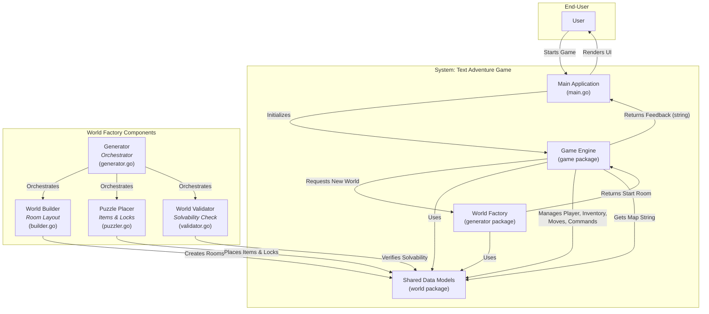

# Game Design and Architecture Document

This document outlines the design decisions, functional and non-functional requirements, and the software architecture for the procedural map generation feature in the text adventure game.

---

## 1. User Experience Goals

The primary goal is to create a strong sense of exploration and replayability. Every time a player starts a new game, they should feel like they are embarking on a fresh adventure.

*   **Sense of Discovery**: The player should be excited to explore, not knowing what's around the next corner. The layout should be unpredictable but logical.
*   **Fair Challenge**: While the map is random, it must always be solvable. The player should feel that their skill and choices determine the outcome, not a lucky or unlucky map generation.
*   **Thematic Cohesion**: The generated world, though random, must feel like a real, coherent place. Room descriptions, items, and their connections should make sense within the game's theme (e.g., a dungeon, a haunted castle).

---

## 2. Functional Requirements (What the system must do)

These are the concrete features the map generation system needs to implement.

### FG-1: World Layout Generation
*   **FG-1.1**: On starting a new game, the system shall procedurally generate a network of interconnected rooms.
*   **FG-1.2**: The system shall designate one room as the `start_room`.
*   **FG-1.3**: The system shall designate one room as the `treasure_room` (the win condition).
*   **FG-1.4**: The system may generate optional side-paths and dead-ends to reward exploration and add a sense of risk.

### FG-2: Puzzle Generation (Key & Door)
*   **FG-2.1**: The system must ensure there is always at least one solvable path from the `start_room` to the `treasure_room`.
*   **FG-2.2**: The system shall place a "locked door" on the guaranteed solvable path.
*   **FG-2.3**: The system shall place a "key" item in a room somewhere in the world.
*   **FG-2.4**: The system must validate that the `key`'s location is accessible to the player *without* having to pass through the `locked_door`. The key cannot be behind the door it unlocks.

### FG-3: Content Population
*   **FG-3.1**: The system shall randomly place non-essential items (e.g., the "sword") in various rooms.
*   **FG-3.2**: The system shall assign thematic and varied descriptions to each room from a pre-defined library to ensure the world feels alive and not repetitive.

### FG-4: Player Experience Support
*   **FG-4.1**: The map visualization (`GetMapString`) must correctly render the procedurally generated layout.

### FG-5: Default Generation Parameters
*   **FG-5.1 (Map Size)**: The system shall generate a world with a default of **10 rooms** (`NumberOfRooms`).
*   **FG-5.2 (Path Complexity)**: The generation algorithm shall ensure the guaranteed-solvable path from the start room to the treasure room consists of at least **4 rooms** (`MinPathToTreasure`). This ensures a minimal level of challenge.
*   **FG-5.3 (Extra Items)**: The system shall place **1** extra, non-essential item (a "sword") randomly in the world (`ExtraItems: ["sword"]`).
*   **FG-5.4 (World Theme)**: To ensure variety and cohesion, the system shall randomly assign names and descriptions to rooms from a pre-defined, thematic pool.

---

## 3. Non-Functional Requirements (How the system must be)

These requirements define the quality, performance, and fairness of the generation process.

### NF-1: Replayability
*   **NF-1.1**: The map generation algorithm must produce a sufficiently high variety of layouts to make consecutive playthroughs feel unique.
*   **NF-1.2**: The perceived difficulty should be relatively consistent. The length of the critical path and the number of optional branches should be within a configurable range. The default critical path length will be at least 4 rooms.

### NF-2: Performance
*   **NF-2.1**: The map generation process must complete with no noticeable delay (<1 second) when a player starts a new game.

### NF-3: Fairness & Winnability
*   **NF-3.1**: The game must be 100% winnable, every time a map is generated. The generation logic must include a validation step to confirm solvability before the game begins.

### NF-4: Maintainability
*   **NF-4.1**: The map generation logic should be modular and decoupled from the core game engine.
*   **NF-4.2**: The parameters for map generation (e.g., number of rooms, branching factor, puzzle complexity) should be configurable to allow for tuning the player experience.

---

## 4. Software Architecture Overview: The "World Factory"

To achieve procedural map generation, we've introduced a new, self-contained `generator` package acting as a "World Factory." This adheres to the principle of **Separation of Concerns**, ensuring the game engine doesn't need to know *how* a world is built, only that it receives a valid one.

### Architecture Diagram

### `generator` Package Components:

*   **`generator.go` (The Factory Foreman)**: Orchestrates the entire generation process, calling other components in sequence and handling errors. It exposes the public `Generate(config Config) (*world.Room, error)` function.
*   **`builder.go` (The Construction Crew)**: Responsible for creating the physical layout of rooms and their connections (the "drunken walk" algorithm). It also assigns random names and descriptions from predefined pools.
*   **`puzzler.go` (The Puzzle Master)**: After the layout is built, this component places the core game elements: identifying the `treasure_room`, placing the `locked_door` on its path, and strategically placing the `key` before the door to ensure solvability. It also places any `ExtraItems`.
*   **`validator.go` (The Quality Inspector)**: Performs a final check on the generated world to ensure it is 100% solvable. It verifies that a path exists from the start to the key, and from the start to the treasure room (once the door is unlocked).

---

## 5. Integration Plan (Conceptual)

1.  **Shared Data (`world` package)**: The core data structures (`Room`, `Item`, `Player`, `Exit`) are moved to a new `world` package, which is imported by both `game` and `generator` to break import cycles.
2.  **`game/game.go`**: The `NewGame()` function now calls `generator.Generate(generator.DefaultConfig())` instead of the static `CreateWorld()`.
3.  **`game/map.go`**: Updated to correctly render the dynamically generated `world.Room` structures.
4.  **Obsolete Files**: The old `game/world.go` (containing the static map) is removed.

This architecture ensures a highly modular, testable, and maintainable system for world generation.