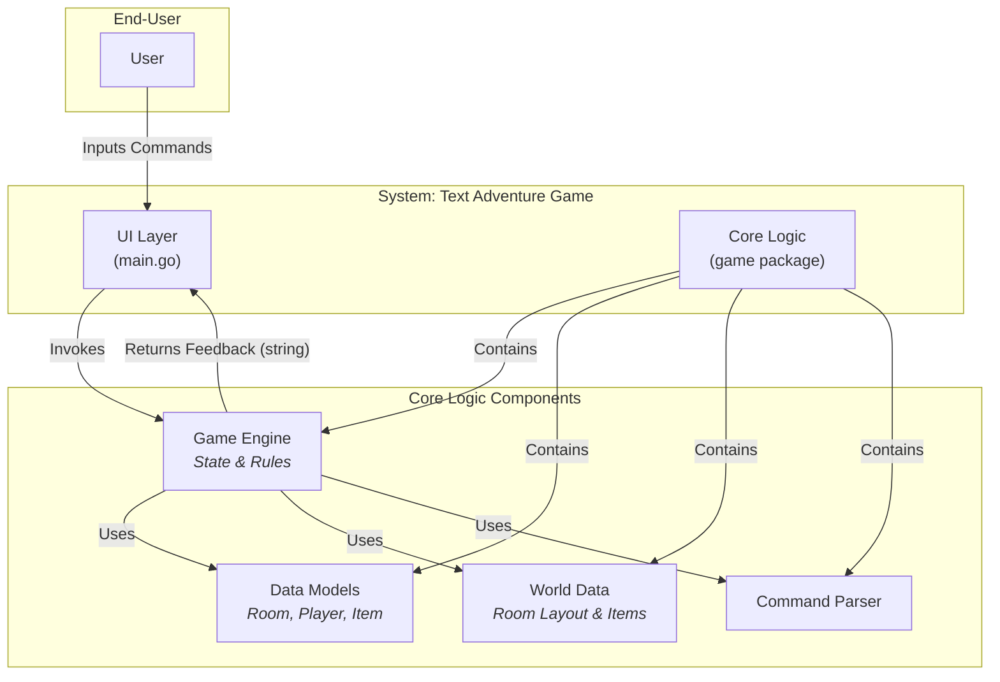

```mermaid
graph TD
    subgraph "End-User"
        User["User"]
    end

    subgraph "System: Text Adventure Game"
        UI["UI Layer<br>(main.go)"]
        CoreLogic["Core Logic<br>(game package)"]
    end

    subgraph "Core Logic Components"
        direction LR
        Engine["Game Engine<br><i>State & Rules</i>"]
        Models["Data Models<br><i>Room, Player, Item</i>"]
        WorldData["World Data<br><i>Room Layout & Items</i>"]
        Parser["Command Parser"]
    end

    %% --- High-Level Flow ---
    User -- "Inputs Commands" --> UI
    UI -- "Invokes" --> Engine
    Engine -- "Returns Feedback (string)" --> UI

    %% --- Core Logic Dependencies ---
    CoreLogic -- "Contains" --> Engine
    CoreLogic -- "Contains" --> Models
    CoreLogic -- "Contains" --> WorldData
    CoreLogic -- "Contains" --> Parser

    Engine -- "Uses" --> Models
    Engine -- "Uses" --> WorldData
    Engine -- "Uses" --> Parser

```
