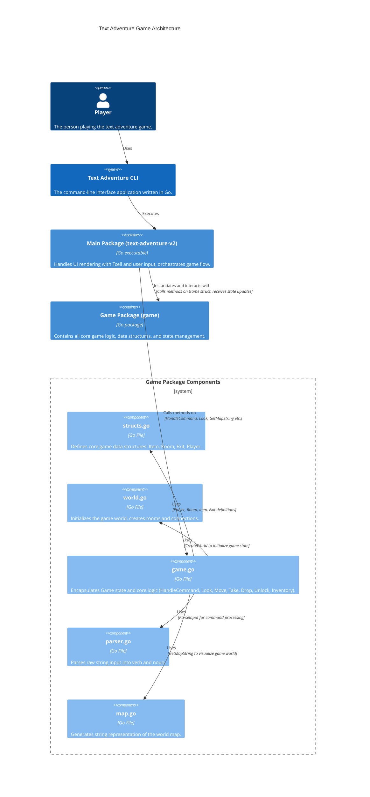

```mermaid
C4Context
    title Text Adventure Game Architecture

    Person(player, "Player", "The person playing the text adventure game.")
    System(game_cli, "Text Adventure CLI", "The command-line interface application written in Go.")

    Rel(player, game_cli, "Uses")

    Container(main_package, "Main Package (text-adventure-v2)", "Go executable", "Handles UI rendering with Tcell and user input, orchestrates game flow.")
    Container(game_package, "Game Package (game)", "Go package", "Contains all core game logic, data structures, and state management.")

    Rel(game_cli, main_package, "Executes")
    Rel(main_package, game_package, "Instantiates and interacts with", "Calls methods on Game struct, receives state updates")

    Boundary(game_package_boundary, "Game Package Components") {
        Component(structs_go, "structs.go", "Go File", "Defines core game data structures: Item, Room, Exit, Player.")
        Component(world_go, "world.go", "Go File", "Initializes the game world, creates rooms and connections.")
        Component(game_go, "game.go", "Go File", "Encapsulates Game state and core logic (HandleCommand, Look, Move, Take, Drop, Unlock, Inventory).")
        Component(parser_go, "parser.go", "Go File", "Parses raw string input into verb and noun.")
        Component(map_go, "map.go", "Go File", "Generates string representation of the world map.")

        Rel(game_go, structs_go, "Uses", "Player, Room, Item, Exit definitions")
        Rel(game_go, world_go, "Uses", "CreateWorld to initialize game state")
        Rel(game_go, parser_go, "Uses", "ParseInput for command processing")
        Rel(game_go, map_go, "Uses", "GetMapString to visualize game world")
    }

    Rel(main_package, game_go, "Calls methods on", "HandleCommand, Look, GetMapString etc.")
```
