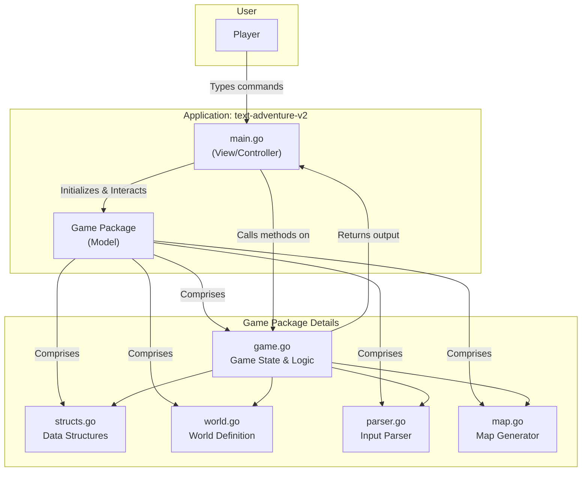

```mermaid
graph TD
    subgraph User
        Player["Player"]
    end

    subgraph "Application: text-adventure-v2"
        direction TB
        MainApp["main.go<br/>(View/Controller)"]
        GameCore["Game Package<br/>(Model)"]
    end

    subgraph "Game Package Details"
        direction LR
        GameStruct["game.go<br/>Game State & Logic"]
        Structs["structs.go<br/>Data Structures"]
        World["world.go<br/>World Definition"]
        Parser["parser.go<br/>Input Parser"]
        MapGen["map.go<br/>Map Generator"]
    end

    %% --- Connections ---
    Player -- "Types commands" --> MainApp
    MainApp -- "Initializes & Interacts" --> GameCore
    GameCore -- "Comprises" --> GameStruct
    GameCore -- "Comprises" --> Structs
    GameCore -- "Comprises" --> World
    GameCore -- "Comprises" --> Parser
    GameCore -- "Comprises" --> MapGen

    MainApp -- "Calls methods on" --> GameStruct
    GameStruct -- "Returns output" --> MainApp

    GameStruct --> Structs
    GameStruct --> World
    GameStruct --> Parser
    GameStruct --> MapGen
```